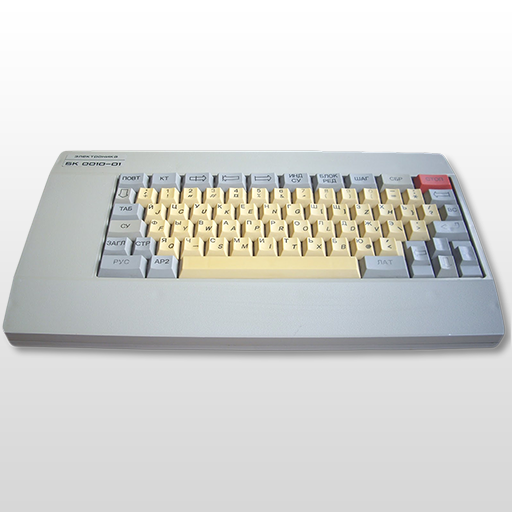

# Elektronika - BK-0010/BK-0011(M)

### Description

BK is an emulator for the Soviet Electronica BK series: БК-0010, БК-0010.01, and БК-0011(M).

### License

BSD

### Icon

### Fanart

Help make me fanart!

### Screenshots

Help make me screenshots!
